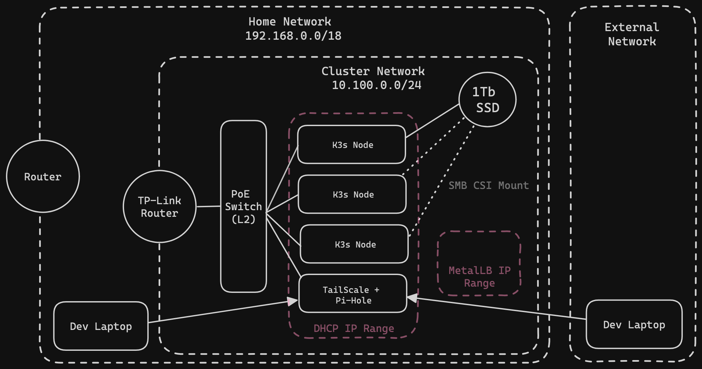

# Big Idea

From the start of my career I have been fascinated by Kubernetes. I love distributed systems and the rich history of how we have arrived where we are today with distributed computing. We are living in the ongoing evolution of our communal vision for cloud computing. In the early years the vision was to present a homogenous Unix-like interface for managing an underlying collection of servers such as BOINC. Now we live in the world of many small virtualized unix environments distributed across servers and sharing compute. 

One of the main drivers of our current state has been the advent of containerization and container orchestration. The goal of this blog is to go over the considerations and design of my baremetal Raspberry Pi Kubernetes cluster. This project was my adventure in going beyond being a user of Kubernetes services from Cloud Provider to understanding the physical magic behind the scenes.

> **Full disclaimer:** This project is largely based-off Anthony Simon's own project for a similar build. I found his blog post lacked a lot of details though so I want to capture those missing parts here and go into more detail about my setup. You can find his great post [here](https://anthonynsimon.com/blog/kubernetes-cluster-raspberry-pi/)!

You can find the Ansible scripts and Helm charts that I manage for this project on my Github:
- [Helm Charts](https://github.com/atmask/helm-charts)
- [Ansible Scripts](https://github.com/atmask/homelab-ansible)

# Goals & Requirements

Before diving into the build list, architecture, and design for my build I want to review what, for me, were goals and requirements for setting up this project. 

### Portability
First, portability. I am in a season of live that is nomadic. I'm in different apartments for a year or two  at a time. I want a build that I can easily unplug, bring somewhere else, and plug-in without needing any extra steps for set up. 

### Isolation & Security
Second, and closely rleated, isolation. I want the network that my cluster runs on to be on a subnet isolated from the LAN network to which it connects. I want all IPs to be in their own non-overlapping address space. I also don't want my service publicly available or available to anyone connected to the LAN of my home network. They should only be accessible via VPN connection to the cluster network or via wireless/wired connection to the cluster LAN.

### Persistent Storage & Back-ups
Third, I wanted my cluster to support some implementation of data persistence vis PVs and PVCs. I wanted this to be affordable and to be reliable. This ruled out out buying SSD storage for each node and using a distributed file store like Rook/Ceph or Longhorn. It also ruled out using hostPath storage on SD cards. (Spolier) My final end result uses a single Terabyte SSD that is running as an SMB share which can be mounted via the SMB csi.

### HTTPs
My fourth requirement is that all of my services should be available over an HTTPs connection. Sure, the VPN is encrpyted, however, I want TLS termination at the cluster and not the only the VPN. Further, I don't want browsers complaining that the site I am visiting is not secure. That is a bother for me and red flag for any firends or family who connect to my services.

### DNS
Lastly, I want my services acessible via DNS records when a user is connected via VPN. I want the DNS server to sit on the LAN network and become the primary DNS server for users when they connect to the network. This keeps my A records off of public DNS servers.

# Architecture

The following diagram lays out my planned network topology for this build. I aim to have a `10.100.0.0/24` CIDR allocated to my cluster network. I will have a dedicated router that manages this subnet. The router and nodes will all share a wired ethernet connection through an L2 Gigabit PoE network switch. Within that cluster network I will configure the DHCP server to assign IPs to the network devices from a subset of the network IPs available. This will allow me, later on, to use another non-overlapping IP range within the cluster CIDR for MetalLB. Kubernetes does not provide a default implementation for allocating IPs to LoadBalancer services. MetalLB is one solution to this problem that I will explore in more depth later on. From the perspective of my cluster network, the home network will be the WAN. All internet-bound traffic will traverse the cluster router gateway and then my home router.

Another detail of this design is the SMB share. I have a 1TB SSD physcially mounted to one of my RPi nodes. This RPi exposes the 1TB drives as an SMB share that can be mounted by other devices on the network. There is a Kubernetes SMB Container Stroage Interface (CSI) driver that supports mounting SMB shares via PVCs. This is how I will implement my poor-man's persistent storage.

> **Note:** This is not intended to be a HA cluster. I only have single master node. The numbers aren't ideal for concensus. In this build I just want to learn the basics.

# Build List
The following is my build list for the project:

- [UCTronics RPi Cluster Case](https://www.amazon.ca/UCTRONICS-Upgraded-Enclosure-Raspberry-Compatible/dp/B09S11Q684/ref=sr_1_4?crid=JEX54GWP1JOC&dib=eyJ2IjoiMSJ9.C3MConprGuDjhcyor3xqbHFZTaOYZQ-UMXrywALspdi5SDWO1Y-sxxMRB3z7amREyELAPupHf69L9M0_G6tXn6-eTOy3oFlSRUIhCTcblHSS83Ybn9AOklxMtFUxUUjyEIzgQ55EoAzs2k4aBAdiq3LjLorJwixpeA2lcnQ0ASsZKZmKcsLxN71W4tF8eZyrDuyV2rqy1jPP1ULJoX2kTgTKjnDKSb7gomFYg37cI1r8BPEU_08oIDUHYRJb40ZIqjnUrh8zC9kDpdL0HTpd5veHNOy4vwbqCbKoVQa9xxY.TuM3a7L5F5Lg9ZPACoqnV1JD-cb_h72fsiNueHpHLek&dib_tag=se&keywords=raspberry+pi+cluster+case&qid=1720281735&sprefix=raspberry+pi+cluster+cas%2Caps%2C300&sr=8-4) x1 
- [Raspberry Pi 4b 8Gb](https://www.raspberrypi.com/products/raspberry-pi-4-model-b/) x1
- [Rapsberry Pi 4b 2Gb](https://www.raspberrypi.com/products/raspberry-pi-4-model-b/) x3
- [1 TB SSD](https://www.amazon.ca/dp/B07LG1QZR8?psc=1&ref=ppx_yo2ov_dt_b_product_details) x1
- [SATA to USB 3.0 Adapter](https://www.amazon.ca/dp/B0C3CRVLCL?psc=1&ref=ppx_yo2ov_dt_b_product_details) x 1
- [TP-Link 5 port Gigabit PoE Network Switch](https://www.amazon.ca/TP-Link-TL-SG1005P-Gigabit-Ethernet-Desktop/dp/B076HZFY3F/ref=sr_1_5?crid=GOMB14TBDH4M&dib=eyJ2IjoiMSJ9.rFy2gUfUpSpNlta74Vt4L7FuHCFtqLlYxHkzGfeaHqfVvdsgsliKExRvTLZfUVOZsJMi6oV_oeiBYjJdc2Ua_d1O9TOlRuSTlxZ0uURcW-Ho48Sac0I01w-HGElUcmY20FcR77wO4VBxcUM9JZ_DoP95RgkPdyIEnUCr_i9yQjEL8Ehb7Mb-Xa-1okeV4VV059LynJa_4W4GCCft1z8wmyg8brwDJViqZCjj6DG4ntWbnoakArdMK_UyexcLV_PDAoFfL_EL8oRz3yDI7CH8tx4ewngLL4atMH26c0he-fQ.v3DpWQNo3aLZ6l1y5IfHnv12MRZ-LPJWjYLpn3H1YJI&dib_tag=se&keywords=PoE&qid=1720282349&sprefix=poe%2Caps%2C153&sr=8-5) x1
- [TP-Link Nano Router](https://www.amazon.ca/TP-Link-TL-WR802N-Wireless-Repeater-300Mbps/dp/B00TQEX8BO/ref=sr_1_7?crid=PDF9HEJ98DVH&dib=eyJ2IjoiMSJ9.KvQ5dyqiNZlOnIsE0BDB9vz-N3ufqlD5goF5RYeXPxn6OF42YXBAlyW2oAtM3n0D8WTKEqcpO6_0mMsUFoZpzFk5YE2XI4r7-_4mC0b-WdkabUp_L8vIkkx9CmG_g2gL_6Srnx6Q6AO36fY1L4z3tg9tB-Xz-8P1cc-EE7tFSALy0BRZa1PPUgbcuWEJaifE3ZcJ1k9jwFDiBpPJ4TgRukyoXAMZekuvOR2Y0mDcdFxbkgYvS5GQ-dY9HdeG56me_TTno__LS8Py-dB-32N_gy4TSELaPbeCnIgnhdDqegg.dC74wSQ2lqQESwGyzGGA2w6ck6SzE4lhHcApK2mE2N4&dib_tag=se&keywords=TP-Link+nano&qid=1720282387&sprefix=tp-link+nano%2Caps%2C159&sr=8-7) x1
- [0.3M Ethernet Cables](https://www.amazon.ca/dp/B01JO3FM7Y/?coliid=I2M4BPL0WE6NVE&colid=3NYBNJHEPFCR4&psc=1&ref_=list_c_wl_lv_ov_lig_dp_it) x4
- [RPi PoE Hat](https://www.amazon.ca/dp/B082ZLDMZ6?psc=1&ref=ppx_yo2ov_dt_b_product_details) x4
> **Note:** I do not receive any commission when you purchase via the above the links. These are just what worked for my build and are what I recommend.

# Configuring Networking
With a project like this you need to start small and work up. Realistically, this means breaking up your end goal into small problems that you can manageably troubleshoot and solve as you go. Trying to take on too much with so many variables and unknowns in one swing will be fatal for a project of this kind. I have broken down this section into the incremental steps I took accomplish my vision for the networking. These steps were goals I wanted to achieve before approaching the problem of setting up Kubernetes.

### Creating the Subnet
When setting up the TP-Link Router the goal is to create subnet. The TP-Link router will be a gateway to my home network LAN and from there traffic will be routed to the internet via my home network route. To do this, I configured the TP-Link Router in WISP mode. In WISP mode, the router adopts the home network as the WAN network and then broadcasts it's own LAN network to which wired/wireless devices can connect. This results in two isolated networks. 

**WAN Settings**:
In this configuration, your TP-Link cluster router will be assigned and IP on your home network. The gateway for the cluster router will be the IP of your home network router.

**LAN Settings**:
In the TP-Link router's LAN settings you'll need to configure the LAN. This is where you can specify the subnet that your cluster nodes will run on. I chose to use the `10.100.0.0/24` CIDR for my cluster network. This will assign a gateway IP to your TP-Link router on this network.

### DHCP Settings
In the TP-Link router DHCP settings you'll want to configure the IP range (within your LAN subnet) that the DHCP server can pull from when assigning IPs to devices joining the cluster network. A DHCP server is a Dynamic Host Configuration Protocol server. When new devices join a network they send out a discovery call to the DHCP server. The DHCP server then returns an offer containing an IP for the devices to use in the network and other configurations such as the DNS server to use.

Later on we'll come back here and configure the DNS

### Static Node IPs
For this build, I did not want to bother with IPs changing for the nodes in my cluster. For this reason I assigned each node linked to the network a static IP.

### Adding a TailScale Subnet Router
Out of my four Raspberry Pis, I have comitted three to the cluster and one to running a TailScale SubnetRouter and Pi-Hole. 

Advertise the routes to the cluster subnet CIDR.

Validate ssh connectivity to the cluster nodes

# Load-Balancing, Ingress, and SSL/TLS Management

### Configuring MetalLB

Ensure it is in the LAN but outside of the DHCP address range to avoid collisions

### Validate with LoadBalancer

### Configuring Nginx-Ingress

### Configureing Cert-Manager

### Local DNS Management with Pi-Hole

# Persistent Storage

### Creating the SMB share

### Setting up the SMB CSI Driver

### Creating a PVC

# Backups with rsync and Backblaze
