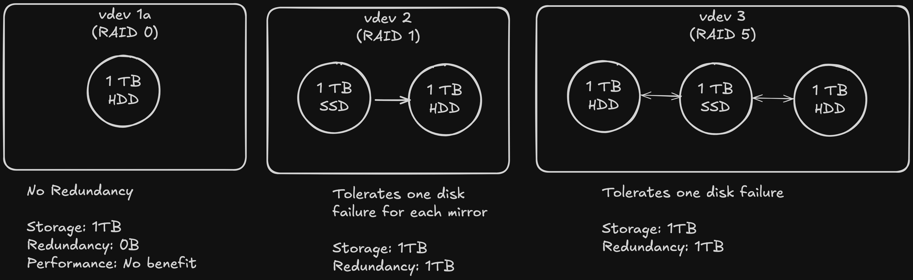

# Big Idea

Zettabit File System (ZFS) is a file system that is very popular in the Homelab community for it's powerful capabilities as a file system and volume manager. It is designed to ensure data integrity and scalbility. While I am not an expert in ZFS, I hope to create guide here that outlines some of the fundamantal concepts of ZFS that I can return to over time.

ZFS has a few key features that I will outline here:
- **Data Integrity:** End to end checksums are used to detect and correct silent data corruption such as bitrot
- **Copy-On-Write (COW):** Rather than overwriting existing data on updates, ZFS uses copy on write for changes. This means that changes are made to a new location and then metadata is updated to point to the new location on completion. COW help reduces the risk of corruption in situations such as power loss during writes
- **Snapshots and Clones:** Instant, space-efficient snapshots and writable clones enable data backup, versioning, and testing.
- **Built-in Compression and Deduplication:** ZFS supports advanced storagesaving features, reducing disk usage without additional hardware overhead.
- **Resilvering:** When a drive fails and is replaced, ZFS resilvers the data by reconstructing only the missing data from parity or mirrored devices. This ensures quick recovery and minimized downtime.
- **Self-Healing:** ZFS automatically detects and corrects data corruption by comparing checksums. If corrupted data is detected, ZFS restores it from mirrored or parity data, ensuring data integrity

# ZFS Raid Types

ZFS includes software RAID functionality. RAID (Redundant array of independent disks) is a redundancy technique for storing data across multiple disks to protect data in the case that a drive fails. RAID has several level/configrations that determine how data is stored across a collection of disks. ZFS uses naming different than traditional RAID naming so the table below provides a mapping of traditional RAID level to ZFS RAID types.

|Traditional RAID |   ZFS     | Description  | Storage Efficiency |
|-----|---------------|------------------------------------------------| ----- |
|Raid 0 | Stiped zpool | Data is broken into block and striped across disks in the pool. This offers read and write performance gain but no redundancy | 100% Storage Utilization|
| Raid 1 | Mirror | Data is written identically across drives in the zpool. Some performance gains for reads | 50% utilization. 50% is redundancy. |
| RAID 5 | RAIDZ1 | Data and single parity is distributed across at least 3 disks. This can tolerate one disk failure. Good read performance but writes are a bit slower due to parity calculations | Lose one drive capacity to parity |
| RAID 6 | RAIDZ2 | Same ans RAIDZ1 but two disks of a minimum for of 4 are used for parity. This can tolerate two drives of failure | 2 drives are lost to parity | 
| RAID 10 | Mirror Striped zpool | Combines RAID 1 Mirroring and RAID 0 Striping for redundancy and performance. This requires 4 drives. Two drives to stripe the data across and two to act as mirrors. | 50% storage efficiency |

# ZFS Storage Heirachy

ZFS surfaces several abstractions for creating a storage heirachy and managing storage. This section will take a look at these abstraction and their heirarchy:

`vdevs > zpool > datasets`

## vdevs

The starting block of the ZFS storage heirachy are vdevs. A vdev is an abstraction around one or more physical drives. Using a vdev, you group one or more disks, regardless of the storage medium, and configure the implementation of redundancy across those disks. This means the a vdev could consist of a single disk in RAID0 (no redundancy benefit but you do still get checksumming), two disks in a Raid 1 (Mirror) configuration and so on with higher RAIDZ levels.

Fig. Some examples of possible vdev layouts. Note that `vdev2` and `vdev3` show a mix of hdd and ssd drives

## zpool

A zpool in ZFS is a collection or vdevs. ZPools abstract away the underlying storage of the pool (vdevs) such that you continuously expand the storage of your entire system by the addition of new vdevs (I will explain this more in "datasets"). 

## datasets

In a traditional fs you put files systems onto volumes. This can results in lots of space free in `/usr` but no space in `/var/db`. This scenarios is helpful for understanding the abstraction of the zpool and datasets. A zpool represents, a pool of free memory (your vdevs). Datasets are one of 3 types of zfs filesystems on top of your zpool.  

# Failure Tolerance

# Expanding Storage in ZFS

ZFS has some constraints around expanding your storage. In particular, it has traditionally not been possible to expand existing vdevs (although some changes may be on the horizon at the time of writing). This has meant that, while it is possible to add storage to your zpool, it must be done through the addition of a new vdev. Depending on your chosen RAID configuration this can be costly if each storage expansion requires three or more disks with equal amount of storage.

To balance redundancy and stay economical I have personally opted on using a RAID 1 configuration. This will allow me to either expand my storage two drives at a time by purchasing them in pairs, or by replacing one drive in a mirror with a larger drive (when the price is right), resilvering, and then replacing the second drive when I have the opportunity.

# References
[ZFS Digital Guide | 45Drives](https://www.45drives.com/pdf/ZFS-Digital-Guide.pdf) \
[ZFS Basics | Youtube](https://www.youtube.com/watch?v=IN_bTYYSXvU&t=1s&pp=ygUDemZz) \
[ZFS for Newbies](https://youtu.be/3oG-1U5AI9A?si=XAtGuYzy6xuH3pzK)
