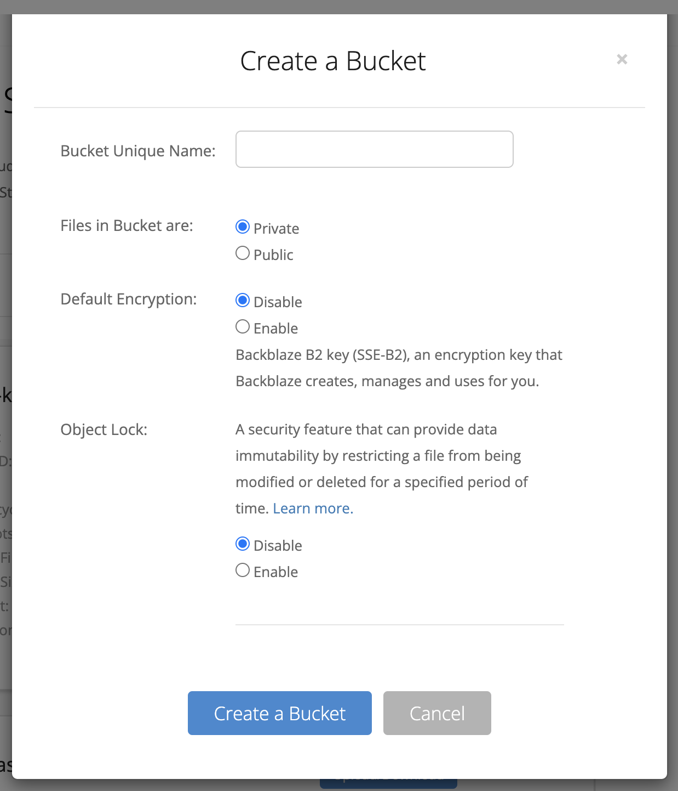
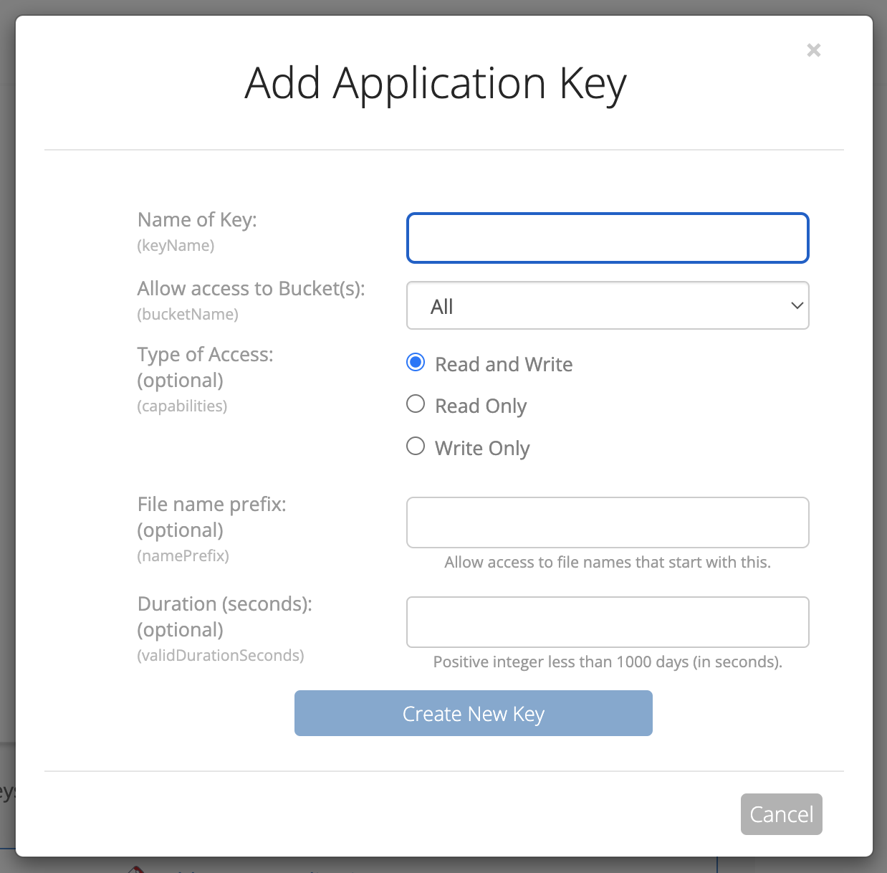
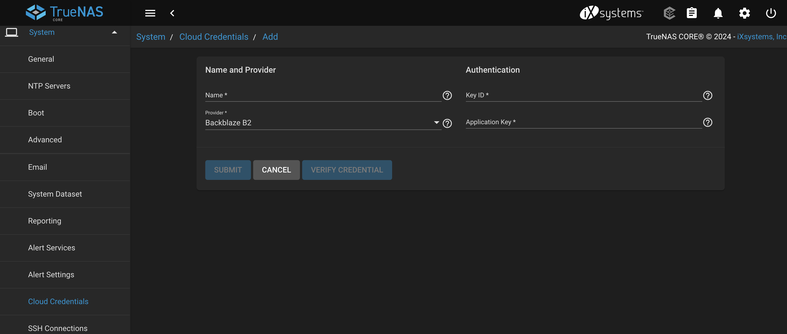
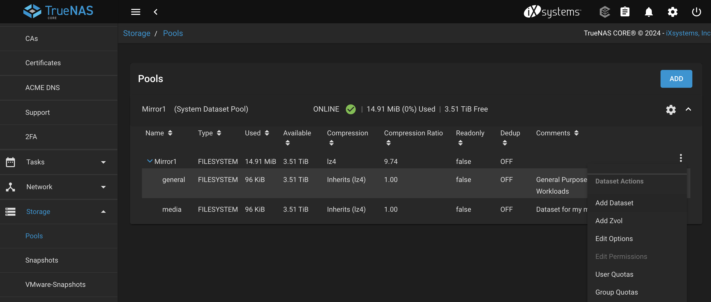

# Big Idea

The goal of this post will be to capture the step required for the backup and restore process of my TrueNAS server. Currenty, my TrueNAS server consists of two 4TB drives in a vdev with a RAID1 (Mirror) config. My goals is to back this up to Backblaze's S3 compatible B2 storage and test recovery before migrating data.

# Creating the B2 Bucket and API Key

Backblaze offers B2 as an S3-compatible storage solution. You'll first need to create a new private storage bucket in B2 with a unique name. Encrpytion and immutability are up to your discretion.

After you have created you bucket head over to "Application Keys". You will need to create a new API Key with access to your bucket. This API Key will then be added to TrueNAS to enable access. You should allow this API Key to access your bucket with read and write permissions, and no prefixes.

Take note of the KeyID and application key. You will need those in the next step!

# Create a Cloud Credential in TrueNAS

Once, you have created you API Key, you will need to create a "Cloud Credential" in TrueNAS. In TrueNAS, go to `System > Cloud Credentials` and choose to add a new cloud credential for the B2 provider.

# Create a Dataset

If you haven't already you will want to create a dataset on your zpool. This can be done from `Storage > Pools > Add Dataset`.

This dataset is what you will be able to share over the network via NFS/SMB/iscsi and is also the level at which we'll configure the backups. When setting up the datasets it is good to think about what data you really need backed up and the type of data in the dataset (i.e. do you need block storage? Use iscsi). I have chose to create a `media` dataset for my media library, which although upsetting to lose, is not as irreplaceable as photos and will not be backed up due to it's size. I will, however, also create a `general` dataset that will store most data and be backed up.

Some reasonable configurations for the dataset:
- Disable de-deup (friends don't let their friends use de-dup)
- Use lz4 compression

# Creating a Cloud Sync Task

The final step is configuring your Cloud Sync Task in TrueNAS. This is under `Tasks > Cloud Sync Tasks`. When configuring the cloud sync task you will want to change the direction to PUSH and select your previously created Cloud Credential for the remote. As the description I like to note what I am backing up and to where (i.e. "mirror1/general to b2 us-west-2").

There are a few options for transfer mode:
- **SYNC:** Sync keeps files identical between source and destination. If a file is deleted at the source, then it will be deleted in the destination.
- **COPY:** Copies each source file to the destination. If a sycned file exists at the source with a matching name then file is overwritten during the sync. 
- **MOVE:** Files are transferred from the source to the destination. Files from the source are deleted after transfer.

