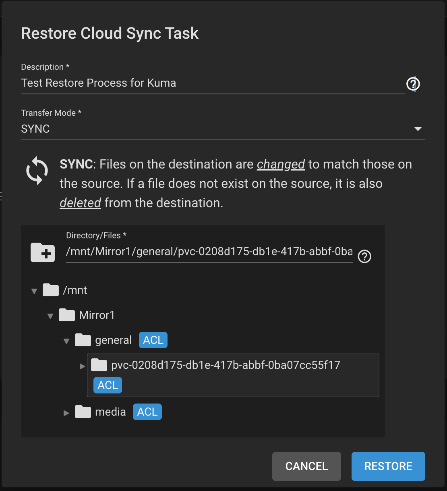
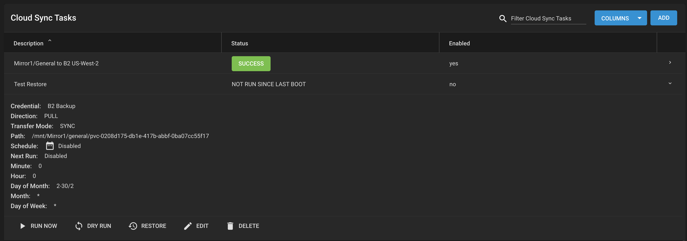
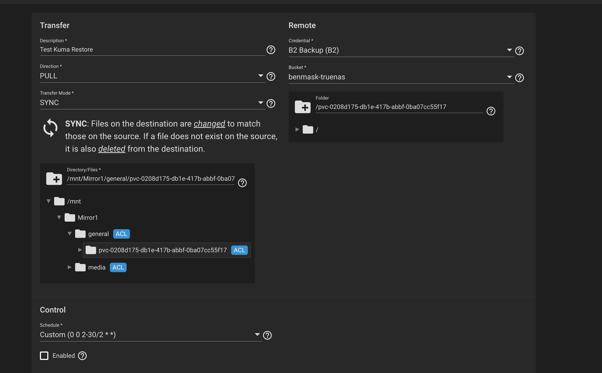

# Big Idea

The goal of this post will be to capture the steps required for the backup and restore process of my TrueNAS server. Currenty, my TrueNAS server consists of two 4TB drives in a vdev with a RAID1 (Mirror) config. My goal is to back this up to Backblaze's S3-compatible B2 storage and test recovery before migrating data out of my old 1TB SSD.

> Once I have these backups in places the 3-2-1 rule will be satisfied:
> - 3 copies of my data
> - 2 different types of storage media
> - 1 off-site backup

# Creating the B2 Bucket and API Key

Backblaze offers B2 as an S3-compatible storage solution that I will use as offsite backup location. If you're following along, you'll first need to create a new private storage bucket in B2 with a unique name. Encrpytion and immutability are up to your discretion.

After you have created your bucket head over to "Application Keys". You will need to create a new API Key with access to your bucket. This API Key will later added to TrueNAS to enable access. You should allow this API Key to access your bucket with read and write permissions, and no prefixes.

Take note of the KeyID and application key. You will need those in the next step!

# Create a Cloud Credential in TrueNAS

Once, you have created you API Key, you will need to create a "Cloud Credential" in TrueNAS. In TrueNAS, go to `System > Cloud Credentials` and choose to add a new cloud credential for the B2 provider.

# Create a Dataset

If you haven't already, you will want to create a dataset on your zpool. This can be done from `Storage > Pools > Add Dataset`.

This dataset is what you will be able to share over the network via NFS/SMB/iscsi and is also the level at which we'll configure the backups. When setting up the datasets, it is good to think about what data you really need backed up and the type of data in the dataset (i.e. do you need block storage? Use iscsi). I have chosen to create a `media` dataset for my media library, which although upsetting to lose, is not as irreplaceable as photos and will not be backed up due to its size. I will, however, also create a `general` dataset that will store most data and be backed up.

Some reasonable configurations for the dataset:
- Disable de-deup (friends don't let their friends use de-dup)
- Use lz4 compression

# Creating a Cloud Sync Task

The final step is configuring your Cloud Sync Task in TrueNAS. This is under `Tasks > Cloud Sync Tasks`. When configuring the cloud sync task you will want to change the direction to PUSH and select your previously created Cloud Credential for the remote. As the description I like to note what I am backing up and to where (i.e. "mirror1/general to b2 us-west-2").

There are a few options for transfer mode:
- **SYNC:** Sync keeps files identical between source and destination. If a file is deleted at the source, then it will be deleted in the destination.
- **COPY:** Copies each source file to the destination. If a sycned file exists at the source with a matching name then file is overwritten during the sync. 
- **MOVE:** Files are transferred from the source to the destination. Files from the source are deleted after transfer.

# Restoring

If you have made it this far, you are likely also interested in testing your ability to restore from backups in case you lose data. This final section will walk through the step for doing a full and partial restore via the TrueNas UI.

First, you will need to go to the cloud sync task which you have configured to run backups. If you expand the backup job you will see an option "Restore". When you click the Restore button a modal will pop up with several config options. 

Give your restore job a clear name. Choose the SYNC transfer mode to have the authoritative back up copy overwrite the data on the restore target (i.e. your TrueNAS instance). Additionally, you can choose the location on the TrueNAS instance to which you wish to have the data synced. After configuration, you will see a new Cloud Sync Task has been created but not yet run.

Now, by default if you run this task it will sync the _entire backup contents_ to the location on your TrueNAS instance that you specified. If, like me, your backups contain data spanning multiple applications this might not be what you want. More likely, you wish to restore a subset of that backup data. To do this you need to edit the restore task.

The above shows an example of doing a partial restore in which the contents of the remote `/pvc-0208d175-db1e-417b-abbf-0ba07cc55f17` are restored into the `/general/pvc-0208d175-db1e-417b-abbf-0ba07cc55f17` folder on the TrueNAS instance/

> 💡 **Note:** The restore process will restore _the contents_ of a folder from a remote _to a folder_ on the TrueNAS instance. This means that if you have a back-up at `/` and `/` contains more than one dir such as `/kuma` and `/movies`, chossing to restore from `/` will recursively sync `/kuma` and `/movies` to the TrueNas instance. However, if you wish to just restore `/kuma` and choose to restore that folder from the remote to `/` on TrueNas instance then the contents of the remote `/kuma` dir will be put directly to `/` on the TrueNAS instance (i.e. the restore process will not create a `/kuma` on the TrueNAS filesystem as part of the restore).
>
> To achieve the desired goal, ensure that `/kuma` exists on the TrueNAS filesystem and restore the contents of the remote `/kuma` to the TrueNAS `/kuma`.

After this is all configured you can run the restore task, validate the data, and delete the restore task. I choose to delete the restore task to avoid any accidental invocations.

# References
[TrueNAS | Cloud Sync Tasks](https://www.truenas.com/docs/core/13.0/coretutorials/tasks/creatingcloudsynctasks/)
