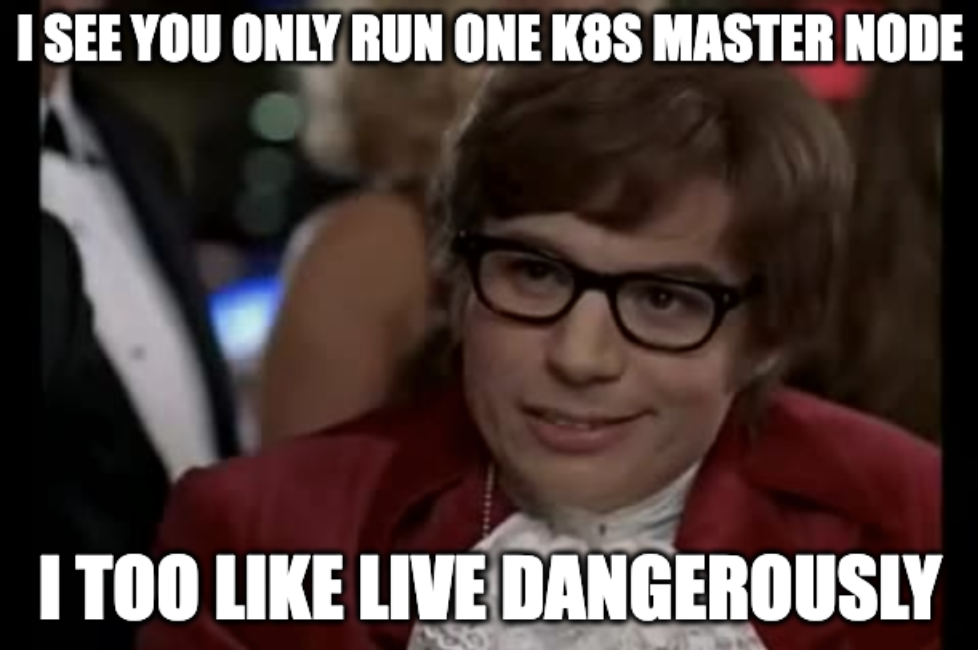

# Big Idea

For a while the K8s cluster in my homelab has been in the precarious situation of only having a single master node. This has bitten me a couple of times when the master node (i.e the "server node" in k3s) has been snafu'ed.



Now that I have compute available on my proxmox server, I want to take the time to virtualize two additional master nodes. Doing this will require understanding a few things at the outset:
- Since the datastore for my cluster is etcd, I will need two additional nodes for a total of three in order to meet quorum. This is a requirement of Raft, the concensus algorithm used by etcd.
- I get a bit closer to a HA configutration with the addition of these nodes, however, two of them being on one machine is less than ideal. With three master nodes, the cluster can handle the failure of one master node. This means that the failure of my physical master node (bondsmith) or the failure of one virtualized node will not result in downtime but the failure of my proxmox server will bring the cluster offline.

> Some might object that I could convert another of my Raspberry pi nodes into a third isolated master node. While this is a good observation, I have chose not to since my other RPi nodes are using SD cards for storage which could not manage the IO of the etcd cluster for long. My single RPi node that currently acts as the master node has an SSD volume for storage.

# Exploring etcd

Before getting started with adding the addition of the the two new master nodes I want to step back and explore etcd a bit. To do this I will add instructions for installing `etcdctl`, a cli tool for managing etcd clusters. It is wirth noting that thew following instructions will be specific to k3s on my installation.

> By default, `etcdctl` is not installed or wrapped by k3s so you will need to manually install it.

First, you will want to find what version of etcd is being used on your k3s cluster in order to install a compatible version of `etcdctl`. To do this, we will need to check the version of k3s (`k3s version`) and then cross-reference the [k3s release notes](https://docs.k3s.io/release-notes/v1.32.X) to see what version of etcd is installed.

Second, you will need to install `etcdctl`. Be mindful of the architecture of the machine you are installing `etcdctl` onto so that you install the correct binary.
```bash
ETCD_VERSION="v3.5.5"
ARCH="amd64" # or arm64 for ARM 
ETCD_URL="https://github.com/etcd-io/etcd/releases/download/${ETCD_VERSION}/etcd-${ETCD_VERSION}-linux-${ARCH}.tar.gz"
curl -sL ${ETCD_URL} | sudo tar -zxv --strip-components=1 -C /usr/local/bin
```

Third, you can now execute commands against etcd by passing the necessary flags for authentication:
```bash
sudo etcdctl version \
  --cacert=/var/lib/rancher/k3s/server/tls/etcd/server-ca.crt \
  --cert=/var/lib/rancher/k3s/server/tls/etcd/client.crt \
  --key=/var/lib/rancher/k3s/server/tls/etcd/client.key
```

